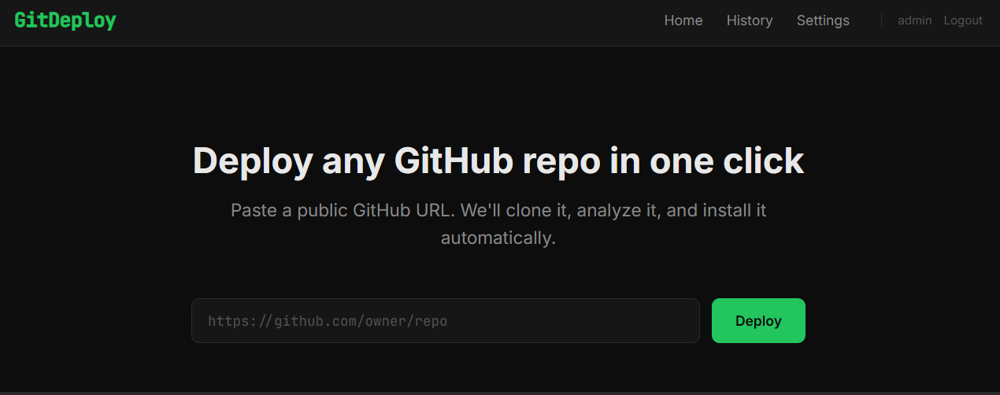

# GitDeploy



**Deploy any public GitHub repository in one click.** Paste a URL, and GitDeploy clones it, detects the stack, provisions any required databases, installs dependencies, and runs it — all inside isolated Docker sandboxes with live-streamed logs.

## Key Features

- **Zero-config deploys** — Analyzes README, config files, and file structure to determine install commands
- **AI fallback** — When templates fail, an LLM generates and iteratively fixes Dockerfiles (supports OpenAI, Anthropic, Gemini, Groq)
- **Automatic database provisioning** — Detects PostgreSQL, MySQL, MariaDB, MongoDB, and Redis requirements; spins up containers with secure random credentials
- **Full isolation** — Each job runs in its own Docker container and network
- **Live log streaming** — Real-time stdout/stderr via WebSocket to a terminal UI
- **Dark terminal UI** — Professional DevOps aesthetic built with React + Tailwind

## Architecture

```
Browser ──► React Frontend (Vite + Tailwind)
                │  REST + WebSocket
                ▼
           FastAPI Backend
                │
                ├── Celery + Redis (Job Queue)
                │       │
                │       ▼
                │   Celery Worker
                │       ├── Repo Analyzer (README parser, config parser)
                │       ├── Stack Detector (file-tree heuristics)
                │       ├── DB Detector (static scan for DB signals)
                │       ├── AI Engine (multi-provider — Dockerfile gen + fix loop)
                │       ├── DB Provisioner
                │       │     ├── Network Manager (per-job Docker network)
                │       │     ├── Credential Manager (random creds + env injection)
                │       │     └── Health-check loop
                │       └── Docker Runner (isolated app container)
                │
                ├── WebSocket Server (Redis pub/sub → browser)
                └── PostgreSQL (GitDeploy's own DB)
```

## Prerequisites

- Docker and Docker Compose
- Git

```bash
git clone https://github.com/Bhaskar-Soni/GitDeploy.git
cd GitDeploy
cp .env.example .env  # Copy environment configuration
docker compose up -d  # Start standard development setup
```

### Production Deployment
For production, use the production overlay which includes resource limits and health checks:
```bash
docker compose -f docker-compose.yml -f docker-compose.prod.yml up -d
```

That's it. Open **http://localhost:5173** and start deploying repos.

> **AI fallback (optional):** Most repos deploy using built-in templates with zero AI calls.
> For repos that need AI-generated Dockerfiles, configure an AI provider in **Settings → AI Settings** from the web UI.
> Supports 17 providers including free ones (Groq, Google Gemini, Cerebras, etc.).

## How It Works

1. **Submit** — User pastes a GitHub URL in the web UI
2. **Clone** — Worker clones the repo (validates size first via GitHub API)
3. **Analyze** — Stack detector identifies the language/framework. Dockerfile template system generates an optimized Dockerfile. If no template matches, the AI generates one.
4. **Detect databases** — Static scanner checks dependency files and source code for database signals (e.g., `psycopg2` in requirements.txt → PostgreSQL). Deduplication logic prevents provisioning conflicting DBs from shared ORMs.
5. **Provision databases** — For each detected DB: create an isolated Docker network, spin up the DB container, generate random credentials, wait for health check, inject connection strings as env vars into the app container.
6. **Build & run** — Dockerfile is built (cache → template → AI generate → AI fix loop). App container runs with DB credentials injected via entrypoint wrapper. All output streams live to the browser.
7. **Cleanup** — On completion (success, failure, or timeout): stop and remove app container, tear down DB containers, destroy the network, delete cloned files.

## Supported Databases

| Database   | Detection Method          | Container Image      | Notes                    |
|-----------|---------------------------|----------------------|--------------------------|
| PostgreSQL | Dependencies + env vars   | `postgres:16-alpine` | Full env var coverage    |
| MySQL      | Dependencies + env vars   | `mysql:8.0`          | Root + app user created  |
| MariaDB    | Dependencies + env vars   | `mariadb:11`         | MySQL-compatible         |
| MongoDB    | Dependencies + env vars   | `mongo:7`            | Auth enabled             |
| Redis      | Dependencies + env vars   | `redis:7-alpine`     | Password via requirepass |
| SQLite     | Detected but skipped      | —                    | No container needed      |

## Supported Stacks

| Stack          | Indicator Files                 |
|---------------|----------------------------------|
| Node.js        | `package.json`                  |
| Python (pip)   | `requirements.txt`              |
| Python (Poetry)| `pyproject.toml`, `poetry.lock` |
| Rust           | `Cargo.toml`                    |
| Go             | `go.mod`                        |
| Java (Maven)   | `pom.xml`                       |
| Java (Gradle)  | `build.gradle`                  |
| Ruby           | `Gemfile`                       |
| PHP            | `composer.json`                 |
| .NET           | `*.csproj`, `*.sln`             |
| Elixir         | `mix.exs`                       |
| Deno           | `deno.json`, `deno.jsonc`       |
| Bun            | `bun.lockb`, `bunfig.toml`      |
| C/C++          | `CMakeLists.txt`, `Makefile`    |
| Scala          | `build.sbt`                     |
| Static Site    | `index.html` (no package.json)  |
| Generic        | fallback                        |

## Environment Variables

| Variable                            | Default                      | Description                                    |
|-------------------------------------|------------------------------|------------------------------------------------|
| `DATABASE_URL`                      | `postgresql+asyncpg://...`   | GitDeploy's own async DB connection             |
| `SYNC_DATABASE_URL`                 | `postgresql://...`           | Sync DB connection for Celery workers           |
| `REDIS_URL`                         | `redis://localhost:6379`     | Redis for Celery broker and pub/sub             |
| `AI_PROVIDER`                       | —                            | AI provider: `openai`, `anthropic`, `gemini`, `groq` |
| `AI_API_KEY`                        | —                            | API key for the chosen provider                 |
| `AI_MODEL`                          | —                            | Model name (e.g., `llama-3.3-70b-versatile`)   |
| `SECRET_KEY`                        | —                            | Fernet key for encrypting DB passwords at rest  |
| `DEFAULT_ADMIN_USER`                | `admin`                      | Default admin username                          |
| `DEFAULT_ADMIN_PASSWORD`            | `admin`                      | Default admin password — **change in production** |
| `JWT_EXPIRY_HOURS`                  | `24`                         | JWT token expiry duration                       |
| `MAX_JOB_TIMEOUT_SECONDS`          | `600`                        | Max job duration before timeout                 |
| `MAX_DB_PROVISION_TIMEOUT_SECONDS` | `60`                         | Max time to wait for DB health check            |
| `MAX_REPO_SIZE_MB`                  | `500`                        | Max repository size allowed                     |
| `DB_DETECTION_CONFIDENCE_THRESHOLD`| `0.7`                        | Above this: auto-provision. Below: ask AI.      |
| `DB_AI_FALLBACK_CONFIDENCE_THRESHOLD`| `0.5`                      | Below this: skip DB provisioning entirely       |

## Security Model

- **Container isolation** — Each job runs in its own Docker container with `no-new-privileges`, 512MB memory limit, 1 CPU
- **Network isolation** — Per-job Docker networks; DB containers are never bound to host ports
- **Command blocklist** — AI-generated commands are filtered through `SecurityChecker` (blocks `rm -rf /`, `sudo`, `curl | bash`, fork bombs, etc.)
- **Credential encryption** — DB passwords are Fernet-encrypted at rest in GitDeploy's database
- **API masking** — Passwords are never exposed via the REST API (replaced with `****`)
- **Size limits** — Repos exceeding `MAX_REPO_SIZE_MB` are rejected before cloning
- **Cleanup guarantee** — `finally` block ensures containers, networks, and temp files are always cleaned up

## How Credentials Work

1. **Generated** — Random 24-char alphanumeric password + unique username per job per database
2. **Injected** — Passed as environment variables to both the DB container (for initialization) and the app container (for connection). Covers all common naming conventions (`DATABASE_URL`, `PGHOST`, `DJANGO_DB_*`, etc.)
3. **Encrypted** — Stored Fernet-encrypted in GitDeploy's PostgreSQL database
4. **Masked** — API responses replace password values with `****`
5. **Destroyed** — When the job completes, DB containers are removed along with the credentials

## Security Warning

> [!CAUTION]
> Always change the `SECRET_KEY` and `DEFAULT_ADMIN_PASSWORD` in your `.env` file for production deployments. Never use the default values provided in `.env.example`.

## Contributing

See [CONTRIBUTING.md](CONTRIBUTING.md) for how to add new language handlers and database types.

## License

MIT
